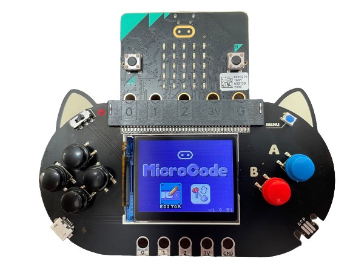
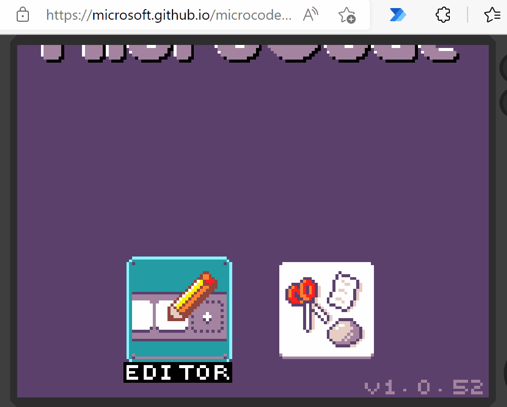

# [Microsoft MicroCode](https://aka.ms/microcode)

Physical computing for young coders on the [micro:bit V2](https://microbit.org).



-   Kid friendly icon-based editor and small programming language
-   Runs on the micro:bit V2 or in the web
-   Keyboard, mouse, touch, screen reader accessible

## Try it out!

There are two ways to run MicroCode:

-   [web app](https://aka.ms/microcode) with [micro:bit V2](https://microbit.org) ([aka.ms/m9](https://aka.ms/m9) for short)
-   [micro:bit V2](https://microbit.org) + [Arcade Shield](https://www.kittenbot.cc/products/newbit-arcade-shield)

See below for more information about the MicroCode web app, and how to deploy MicroCode to the micro:bit V2. Regardless of which way you run MicroCode, you will probably want to know a little bit about
MicroCode's:

-   [{:class="icon"}](./language) [icon-based language](./language)
-   [{:class="icon"}](./samples) [samples](./samples)
-   {:class="icon"} [FAQ](./faq.md)

## [Web editor](https://aka.ms/m9)

The easiest way to get started with MicroCode is through the web editor ([https://aka.ms/microcode](https://aka.ms/microcode), [aka.ms/m9](https://aka.ms/m9) for short). We recommend using the keyboard navigation or a real gamepad!

-   Arrow keys for D-pad
-   `Space` for A button
-   `Backspace` (`delete` on MacOs) for B button
-   Copy the URL to share your program.

[{:class="screenshot"}](https://aka.ms/m9)

### Web App and micro:bit V2

Click on the micro:bit button at the lower right of the web app (see above) and follow the on-screen instructions to configure your micro:bit V2 and pair it with the editor.
Once your micro:bit V2 is paired, the web editor will be able to download Your
MicroCode program to your micro:bit. This happens on every edit, so your program
is always up-to-date (and running)!

### Accessibility

We attempted to make the editor as accessible as possible; please send us suggestions to improve the accessibility of the editor.

#### Keyboard navigation

MicroCode can be programmed with keyboard, game controllers (such as XBox controllers), mouse or touch inputs.

#### Screen reader

The editor integrates with existing screen readers, like NVDA.

#### Tooltip read aloud

By clicking on the `tooltip reader` button at the bottom of the editor, you can turn on read aloud of editor tooltips. This may be useful for students who are still learning to read.

## micro:bit V2 and Arcade Shield

Click on the version number in the web app to download the MicroCode hex file to your micro:bit V2. When you plug the micro:bit into the Arcade Shield, MicroCode should start running. Your MicroCode program is always live and runnable. Once you removed the micro:bit from the shield, the program will persist and continue to run.

### [micro:bit V2](https://microbit.org) + [Arcade Shield](https://www.kittenbot.cc/products/newbit-arcade-shield)

{:class="fluid"}

## Sample programs

The MicroCode app has a set of [samples](./samples) built-in. Select the samples button on the MicroCode home page (see below) to reveal
the gallery of samples.

{:class="screenshot"}

## Contributing

-   Start a discussion thread at [https://github.com/microsoft/microcode/discussions](https://github.com/microsoft/microcode/discussions).

This project is open source and welcomes contributions and suggestions at https://github.com/microsoft/microcode.
Read the [developer instructions](./develop.md).


