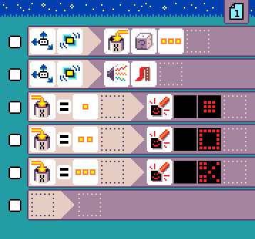
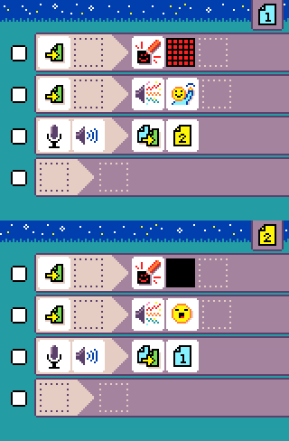

# Samples

These are some of the annotated MicroCode
samples.

## Single player

### {:class="icon-sample"} First program

{:class="sample"}

When you select **new program** and keep pressing **A**
in the editor after selecting the new program sample.

The program has one rule that paints a smiley when button A (on the micro:bit) is pressed.

{:class="rule"}

-   **when** {:class="icon"} press {:class="icon"} button A, **do** {:class="icon"} paint screen with smiley.

#### improvement ideas

- keep adding images to create an animation
- checkout the [smiley buttons](#smiley-buttons) sample to see how to handle button B.

## {:class="icon-sample"} Flashing Heart

{:class="sample"}

The goal of this program is to show a cute heart animation.

We use a single rule with a {:class="icon"} timer. The timer starts a {:class="icon"} screen animation
with two images. Each time the timer triggers again, it repaints both images which create the heart animation.

{:class="rule"}

-  **when** {:class="icon"} timer triggers, **do** {:class="icon"} paint screen with heart.

#### improvement ideas

-   add more animation frames to create a better beating heart
-   make your own animation

### {:class="icon-sample"} Smiley Buttons {#smiley-buttons}

{:class="sample"}

The goal of this program is to show a smiley
when pressing A, and a frowney when
pressing B.

{:class="rule"}

-   **when** {:class="icon"} press {:class="icon"} button A, **do** {:class="icon"} paint screen with smiley.

{:class="rule"}

-   **when** {:class="icon"} press {:class="icon"} button B, **do** {:class="icon"} paint screen with frowney.

#### improvement ideas

-   add sound emoji for each buttons to make it more lively

### {:class="icon-sample"} Pet Hamster

{:class="sample"}

Keep your micro:pet happy by petting
its head (Logo) and don't shake it, it does not like that.

{:class="rule"}

- **when** page started, **do** {:class="icon"} paint screen with neutral mood

Touching the micro:bit logo makes it happy.

{:class="rule"}

-   **when** {:class="icon"} press {:class="icon"} micro:bit logo, **do** {:class="icon"} paint screen with happy animation.

{:class="rule"}

-   **when** {:class="icon"} press {:class="icon"} micro:bit logo, **do** {:class="icon"} play sound emoji {:class="icon"} giggle.

Shaking makes it unhappy.

{:class="rule"}

-   **when** {:class="icon"} {:class="icon"} shake, **do** {:class="icon"} paint screen with unhappy animation.

{:class="rule"}

-   **when** {:class="icon"} {:class="icon"} shake, **do** {:class="icon"} play sound emoji {:class="icon"} sad.

#### improvement ideas

-   use more rules to manipulate the mood of your pet

### {:class="icon-sample"} Rock Paper Scissors

{:class="sample"}

The classic game of rock paper scissors
where the micro:bit display a different
symbol when shaken.

The program starts with a rule that uses
a shake event and 3-face dice is cast. The result is stored in variable `X`.

{:class="rule"}

-   **when** {:class="icon"} {:class="icon"} shake, **do** {:class="icon"} set variable X to {:class="icon"} random number between 1 and {:class="icon"} 3.

The next 3 rules match the value passed in variable `X`
and display a different symbol for each value, 1, 2 or 3.

{:class="rule"}

- **when** {:class="icon"} variable `X` changes to {:class="icon"} 1, **do** {:class="icon"} paint screen with paper.

{:class="rule"}

- **when** {:class="icon"} variable `X` changes to {:class="icon"} 2, **do** {:class="icon"} paint screen with rock.

{:class="rule"}

- **when** {:class="icon"} variable `X` changes to {:class="icon"} 3, **do** {:class="icon"} paint screen with scissors.

#### improvement ideas

-   add sound emoji whenever shake happens
-   clear the screen before showing the new symbol

### {:class="icon-sample"} Hot potato

{:class="sample"}

Pass the hot potato around and make
sure it does not beep while you have it
in your hands!

#### improvement ideas

-   add sound emoji when timer expires
-   add a better expired potato animation

### {:class="icon-sample"} Clap Lights

{:class="sample"}

Allows to turn on and off the LEDs of the screen. When a loud sound is detected
switch between page 1 and page 2 where the page start by turning on or off the LEDs.

#### improvement ideas

-   add sounds to notify your user that the command was received

## Multi player

These sample use the radio and will only work if you have multiple micro:bit talking to each other!

### {:class="icon-sample"} Chuck a duck

{:class="sample"}

This is a radio program so you'll need 2 micro:bits running to get it to work.

The program "sends" a duck using the radio
by pressing A.

In code, the accelerometer sensor is used
in two rules to clear the screen (duck is gone)
and send a number using the radio.

The third rule uses the radio filter to render
the duck on the screen. This rule executes
when a radio message is received.

#### improvement ideas

-   add sound emoji when the duck arrives
-   use different radio messages for different images

### {:class="icon-sample"} Firefly

{:class="sample"}

Fireflies in the wild synchronize their glowing although there is no leader to give the tempo.
Go to [http://ncase.me/fireflies/](http://ncase.me/fireflies/) and read about the fireflies synchronization phenomenon.

Just like fireflies in the wild, you can create program that synchronize blinking
between any number of micro:bit! The firefly program uses two pages, page 1 will run when the light is off
and page 2 will handle a glow.

In {:class="icon"} page 1, we add a rule that clears the screen and keeps a dot {:class="icon"} when the page starts.

The clock of the firefly will be held in {:class="icon"} variable `X`. It starts at {:class="icon"} 1 and once it reaches 8, the firefly will glow. The next two rules are about moving the clock forward. The {:class="icon"} `repeat timer` rule moves the clock every {:class="icon"} quarter of a second; the {:class="icon"} `radio receive` moves the clock by 1 whenever a neighboring firefly sent a message.

The next rule, {:class="icon"} **when** variable `X` changed to 8, transitions to {:class="icon"} page 2 when the clock reaches `8`.
Since it is possible that we miss the number `8` because the firefly received many radio updates at once,
we add one last rule, a `repeat timer every 3s` that transitions to page 2.

On  page 2, the variable `X` is {:class="icon"} set to {:class="icon"} 1, a radio message is sent to other firefly so that they can nudge their clock ({:class="icon"}), all the LEDs are turned and a sound is played.
After half a second, we transition back to page 1 to restart the non-glow phase.

#### improvement ideas

-   use a radio group to avoid interference with other users
-   remix this technique with other programs to create new synchronized experiences!

## Accessories

The samples in this section using [Jacdac](https://aka.ms/jacdac) modules to extend the micro:bit with programmable LEDs, servo and other sensors/actuators.

### {:class="icon-sample"} Railroad crossing {#railroad_crossing}

{:class="sample"}

This program controls a railroad crossing.

The {:class="icon"} `servo` uses a [servo motor](https://microsoft.github.io/jacdac-docs/services/servo/) move to move an physical arm. The {:class="icon"} `servo` arm orientation is mapped to the wall clock hours: `0` (or `12`) is on rotated 90 degree from the resting position to the left, `6` is rotated 90 degree right from the rest position.

The {:class="icon"} `LED` uses a [programmable LED ring](https://microsoft.github.io/jacdac-docs/services/led/) module to display blue and red colors.
